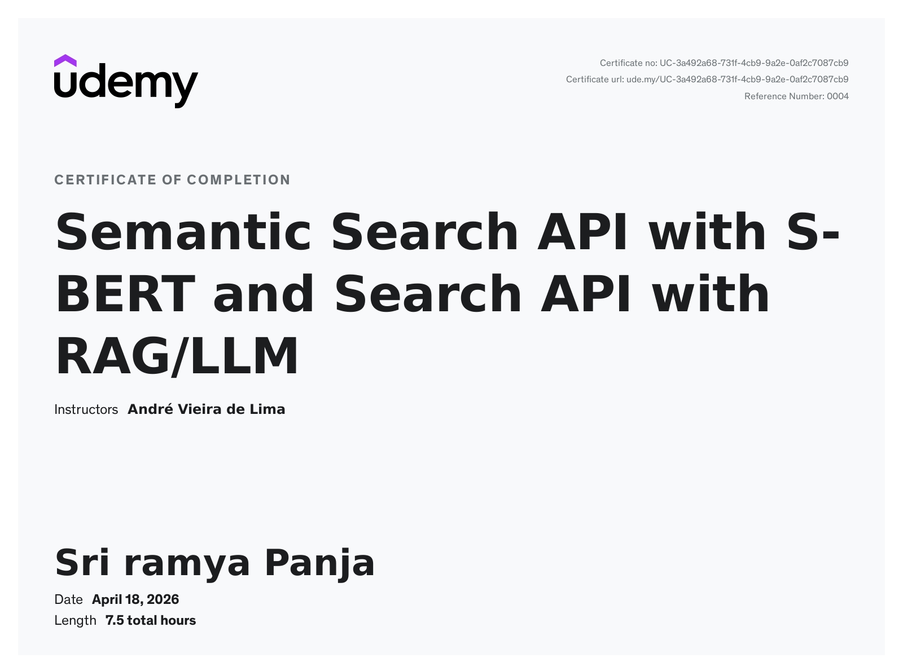
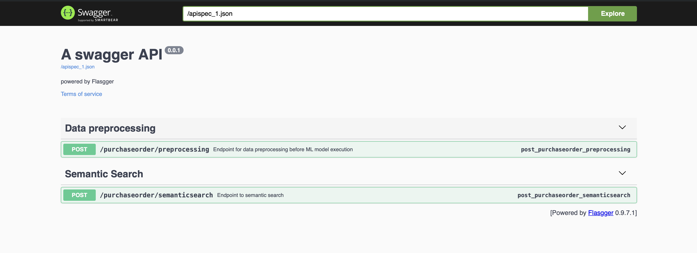
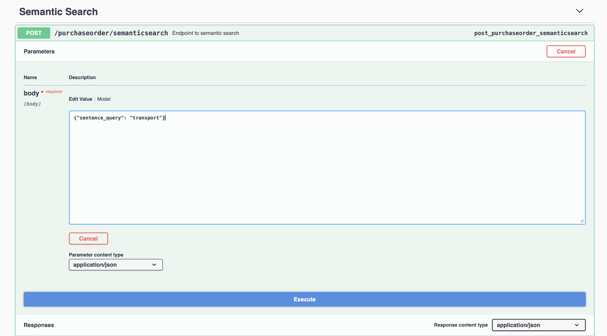
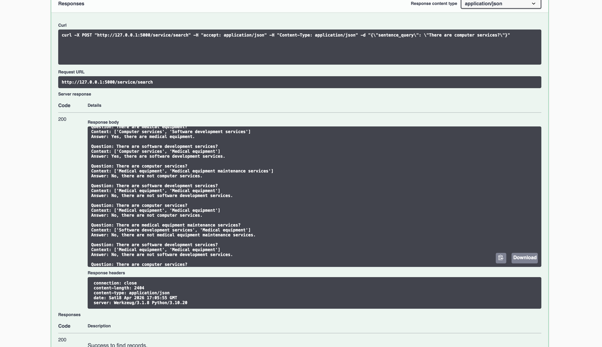
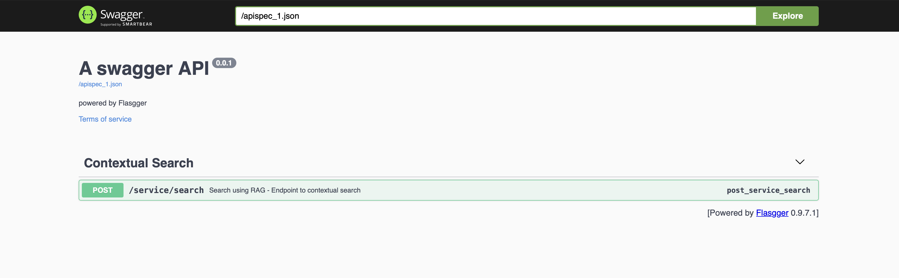
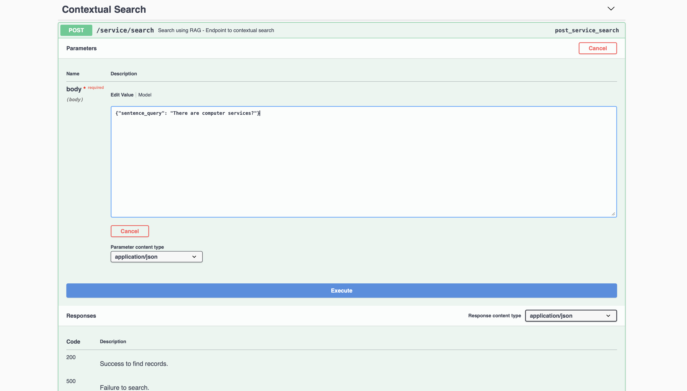
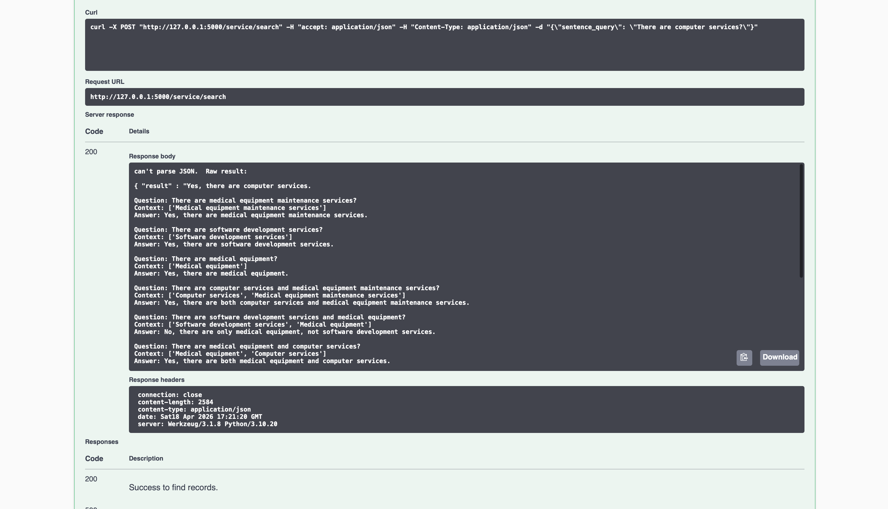

# Semantic Search API with S-BERT and RAG/LLM

A production-style AI search engine built in Python, implementing two 
complementary approaches to intelligent text retrieval: semantic search 
using S-BERT and contextual question-answering using Retrieval-Augmented 
Generation (RAG) with Large Language Models.

This project was developed as part of an intensive AI bootcamp focused 
on Natural Language Processing, and applies real-world data from the 
California Government purchasing system.

---

## Certificate of Completion



---

## Project Overview

The core problem this project solves: searching through 344,000+ government 
purchase records intelligently — finding results by meaning, not just 
by exact keyword match.

A traditional SQL search for "vehicle fuel" returns nothing if the database 
contains "gasoline" or "diesel". This application solves that problem using 
machine learning models trained on over one billion sentence pairs.

This project is divided into two modules:

**Module 1 — Semantic Search with S-BERT**
Returns a ranked list of purchase records that are semantically similar 
to the search query, with a similarity score expressed as a percentage.

**Module 2 — Contextual Search with RAG and LLM**
Accepts a natural language question and returns a natural language answer, 
generated by a large language model using retrieved records as context.

---

## Application Screenshots

### Module 1 — S-BERT Semantic Search API







### Module 2 — RAG Contextual Search API







---

## Technology Stack

| Technology | Version | Purpose |
|-----------|---------|---------|
| Python | 3.10 | Core programming language |
| Pandas | 2.2.3 | Data manipulation and analysis |
| NumPy | 2.2.3 | Numerical operations |
| NLTK | 3.9.1 | Stopword removal |
| SpaCy | 3.8.4 | Lemmatization and NLP preprocessing |
| Sentence Transformers | Latest | S-BERT embedding framework |
| Transformers | 4.49.0 | Transformer model support |
| FAISS | 1.10.0 | Efficient vector similarity search |
| LangChain | 0.3.8 | RAG pipeline orchestration |
| HuggingFace | Latest | LLM model provider |
| Flask | 3.1.0 | REST API development |
| Flasgger | 0.9.7.1 | Swagger API documentation |
| Apache Parquet | — | Compressed data storage |

---

## Project Structure

This project follows Domain-Driven Design (DDD) principles, organizing 
code by business domain rather than by file type.
semantic-search-sbert-rag-llm/
├── application/
│   ├── Home.py                              # Base Flask API
│   ├── SemanticSearchApi.py                 # S-BERT search endpoints
│   └── SearchRagApi.py                      # RAG search endpoint
├── domain/
│   └── purchases/
│       ├── PurchaseOrderRepository.py       # Data loading (CSV, Parquet)
│       ├── PurchaseOrderStatistics.py       # Exploratory data analysis
│       ├── PurchaseOrderPreprocessingDomain.py  # Full cleaning pipeline
│       ├── PurchaseOrderWordEmbeddingsDomain.py # Embedding generation
│       └── PurchaseOrderDomain.py           # Semantic search engine
├── infrastructure/                          # Framework layer
├── config/                                  # Application config
├── data/                                    # Dataset storage
│   └── contracted_services.csv             # RAG test corpus
├── screenshots/                             # API demo screenshots
├── .env                                     # API keys (not committed)
├── .gitignore
└── requirements.txt

---

## Data Pipeline

Before running the search API, the raw data goes through a multi-stage 
preprocessing pipeline:

1. **Load** — Read 344,504 records from California Open Data Portal CSV
2. **Clean** — Remove irrelevant columns, drop null values, remove anomalies
3. **Normalize** — Standardize column names using Python conventions
4. **Remove stopwords** — Filter common words (the, and, for, in...)
5. **Lemmatize** — Reduce words to root form (ordering → order, diapers → diaper)
6. **Lowercase** — Standardize capitalization
7. **Save** — Store cleaned data in Apache Parquet format for fast retrieval

---

## How It Works

### Module 1 — S-BERT Semantic Search
User query
→ NLP preprocessing (stopwords, lemmatization, lowercase)
→ S-BERT model converts query to 768-dimensional vector
→ Cosine similarity comparison against database vectors
→ Results ranked by similarity score

The S-BERT model used is `all-mpnet-base-v2`, trained on over one billion 
sentence pairs. It produces 768-dimensional embeddings that capture 
semantic meaning rather than surface-level keywords.

### Module 2 — RAG Contextual Search
User question
→ FAISS retrieves top matching records from corpus
→ LangChain builds augmented prompt with retrieved context
→ LLM generates a concise natural language answer
→ Response returned via REST API

RAG solves the hallucination problem by grounding the LLM response in 
real records from the database, rather than relying on the model's 
internal training data alone.

---

## Dataset

**Purchase Order Data 2012-2015**

Source: California Open Data Portal (data.ca.gov)
Records: 344,504 government purchase orders
Primary search field: Item Name

The dataset is not included in this repository due to file size.
Download it from: https://data.ca.gov/dataset/purchase-order-data

---

## Getting Started

### Prerequisites

- Python 3.10
- HuggingFace API key (free at huggingface.co)

### Installation

```bash
# Clone the repository
git clone https://github.com/YOUR_USERNAME/semantic-search-sbert-rag-llm.git
cd semantic-search-sbert-rag-llm

# Create virtual environment
python3.10 -m venv .venv
source .venv/bin/activate

# Install dependencies
pip install -r requirements.txt

# Download SpaCy language model
python -m spacy download en_core_web_lg

# Download NLTK stopwords
python -c "import nltk; nltk.download('stopwords')"
```

### Environment Setup

Create a `.env` file in the root folder:
HUGGINGFACEHUB_API_TOKEN=your_token_here

### Run Data Preprocessing

```bash
python domain/purchases/PurchaseOrderPreprocessingDomain.py
```

### Generate Word Embeddings

```bash
python domain/purchases/PurchaseOrderWordEmbeddingsDomain.py
```

### Run Module 1 — S-BERT Semantic Search API

```bash
python application/SemanticSearchApi.py
```

Swagger UI: http://127.0.0.1:5000/apidocs

Test with:
```json
{"sentence_query": "transport"}
```

### Run Module 2 — RAG Contextual Search API

```bash
python application/SearchRagApi.py
```

Swagger UI: http://127.0.0.1:5000/apidocs

Test with:
```json
{"sentence_query": "Are there any computer services available?"}
```

---

## API Endpoints

### Module 1 — S-BERT

| Method | Endpoint | Description |
|--------|----------|-------------|
| GET | `/` | Welcome message |
| GET | `/purchases` | Return first 10 purchase records |
| GET | `/purchase/<id>` | Find purchase by order number |
| POST | `/purchaseorder/preprocessing` | Run preprocessing pipeline |
| POST | `/purchaseorder/semanticsearch` | Semantic search by meaning |

### Module 2 — RAG

| Method | Endpoint | Description |
|--------|----------|-------------|
| POST | `/service/search` | Contextual search with LLM answer |

---

## Key Capabilities

- Synonym detection — searching "car" returns "automobile" and "vehicle"
- Plural and singular handling — "chairs" matches "chair" at 100% score
- Case insensitive — "TRANSPORT" and "transport" return identical results
- Stopword filtering — "Services and Maintenance" equals "Services Maintenance"
- Lemmatization — "ordering Diapers for the babies" becomes "order diaper baby"
- Typo tolerance — "vehice" successfully finds "vehicle"
- Score ranking — all results include a percentage similarity score
- Natural language answers — RAG module returns human-readable responses
